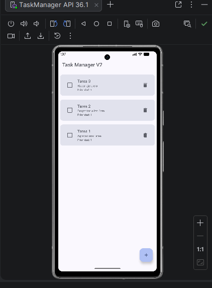
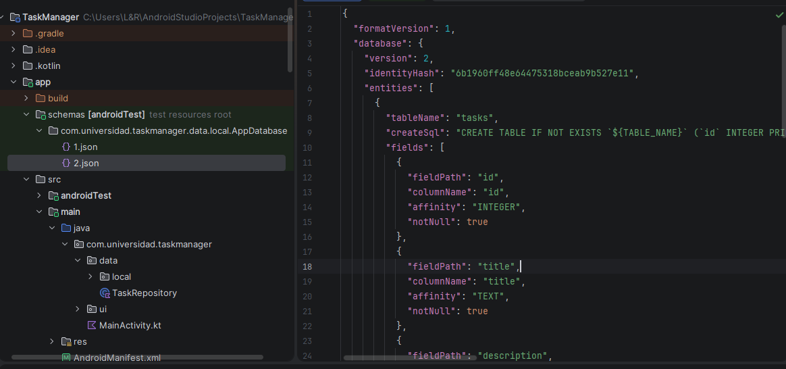
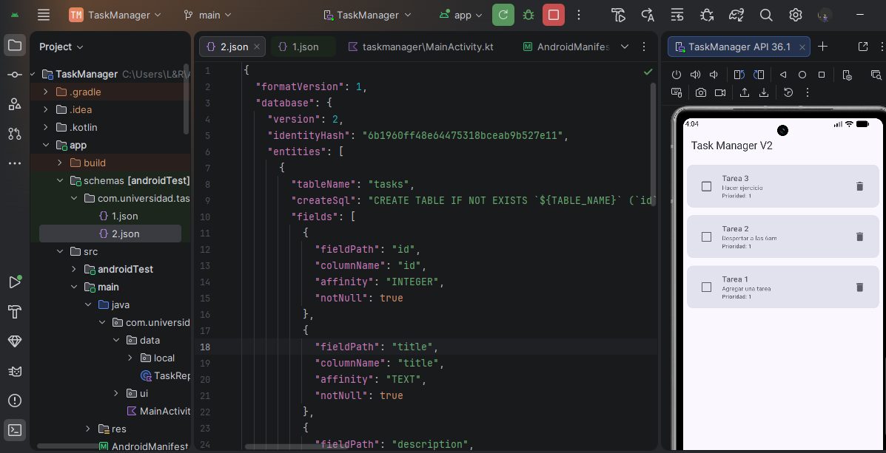
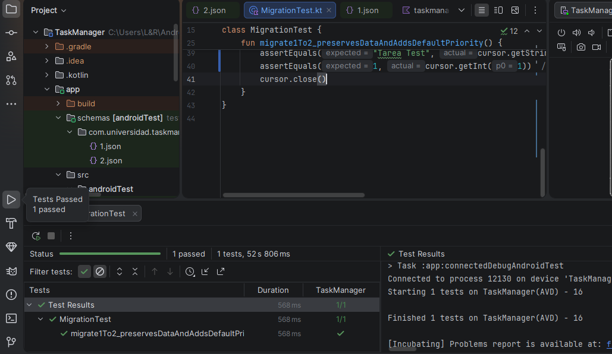

# TaskManager - Room Database con Migraciones

##  Descripción del Proyecto
Este proyecto consiste en el desarrollo de una aplicación Android llamada **TaskManager**, implementada en Kotlin, que permite gestionar tareas utilizando **Room Database** con arquitectura **MVVM**.

La aplicación evoluciona desde una versión inicial (v1) hasta una versión mejorada (v2), aplicando una migración de base de datos sin pérdida de información.

##  Objetivo de la Actividad
Implementar una aplicación Android que:
- Utilice Room Database (Entity, DAO, Database)
- Maneje datos con ViewModel y StateFlow
- Realice una migración de esquema de versión 1 a versión 2
- Verifique la migración mediante pruebas

##  Tecnologías Utilizadas
- Kotlin
- Android Studio
- Room Database
- ViewModel
- StateFlow
- Coroutines
- Migration API (Room)

##  Estructura del Proyecto

Garzon-post1_u4-main/
├── app/
│ ├── schemas/
│ │ └── com.universidad.taskmanager.data.local.AppDatabase/
│ │ ├── 1.json
│ │ └── 2.json
│ └── src/
│ ├── main/java/com/universidad/taskmanager/
│ │ ├── data/local/
│ │ ├── data/
│ │ └── ui/
│ └── androidTest/
├── evidencias/
│ ├── captura_lista_tareas.png
│ ├── captura_esquema_v2.png
│ ├── captura_datos_migrados.png
│ └── captura_test_migration.png
└── README.md

## Implementación

### Versión 1
Se implementa:
- Entidad `TaskEntity`
- DAO `TaskDao`
- Base de datos `AppDatabase`
- Operaciones CRUD con Flow

### Versión 2 (Migración)
Se agrega un nuevo campo:
kotlin
val priority: Int = 1

Se implementa la migración:

database.execSQL(
    "ALTER TABLE tasks ADD COLUMN priority INTEGER NOT NULL DEFAULT 1"
)

- Se asegura que los datos anteriores no se pierdan
- Se asigna prioridad por defecto

Prueba de Migración

Se implementa un test con MigrationTestHelper que:

Crea base de datos en versión 1
Inserta datos
Ejecuta migración a versión 2
Verifica que los datos se mantengan
Evidencias

###  Lista de tareas

###  Esquema v2

###  Migración

###  Test

